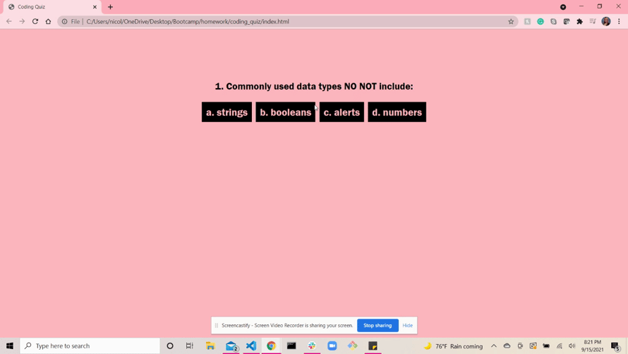

# JavaScript Coding Quiz

## Description

This quiz was made using vanilla JavaScrip, HTML and CSS. My motivation was to create an interactive quiz about JavaScrip, using JavaScript. I built this to practice using JavaScript and bring life to my quiz. 

## Usage

The link to the coding quiz is here: https://nicolepingar.github.io/coding_quiz/

An animated image of the web application is below:

## How to Contribute
Please find me on GitHub @nicolepingar or email me at nicolepingar@gmail.com.